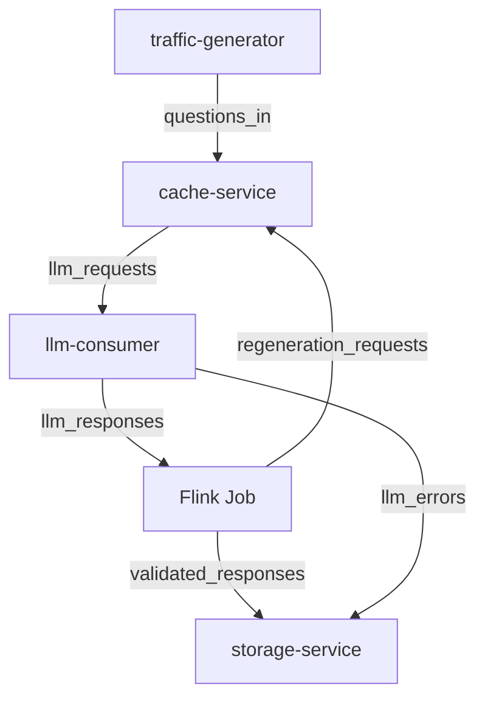

# Servicios y responsabilidades

A continuación se detallan los servicios que conforman la plataforma y sus interacciones principales.

## Generación de tráfico (`traffic-generator`)
- Publica preguntas en el tópico Kafka `questions_in`.
- Permite definir distribuciones de llegada y volumen mediante variables de entorno.
- Registra en `data_collected/` los eventos emitidos para análisis posterior.

## Servicio de caché (`cache-service`)
- Consume preguntas desde `questions_in`.
- Consulta primero una caché interna y luego MongoDB para reutilizar respuestas previas.
- En caso de no encontrar respuesta válida, envía una solicitud al tópico `llm_requests`.

## Consumidor LLM (`llm-consumer`)
- Atiende mensajes en `llm_requests` y produce respuestas en `llm_responses`.
- Puede operar en modo offline determinístico para pruebas reproducibles.
- Implementa política de reintentos con *exponential backoff* ante fallos al invocar el modelo.
- Emite errores críticos en el tópico `llm_errors`.

## Job de Flink
- Componentes desplegados: `jobmanager`, `taskmanager` y `flink-submit`.
- Ejecuta `flink_job/streaming_score_job.py` para puntuar respuestas mediante TF-IDF.
- Valida respuestas comparándolas contra el umbral `SCORE_THRESHOLD`.
- Registra solicitudes de regeneración en `regeneration_requests` cuando una respuesta no alcanza la calidad requerida.
- Mantiene estado para evitar bucles de regeneración infinitos.

## Servicio de almacenamiento (`storage-service`)
- Consume respuestas validadas desde `validated_responses`.
- Persiste en MongoDB el texto de las respuestas, metadatos y métricas agregadas.
- Expone un documento `metrics` con estadísticas globales del sistema.

## Dependencias externas
- **Kafka y Zookeeper**: gestionan la mensajería y la coordinación de los tópicos.
- **MongoDB**: almacena preguntas, respuestas, métricas y resultados del scoring.

## Comunicación entre servicios

El diagrama ilustra el flujo principal de mensajes y las rutas de retroalimentación en el sistema.
